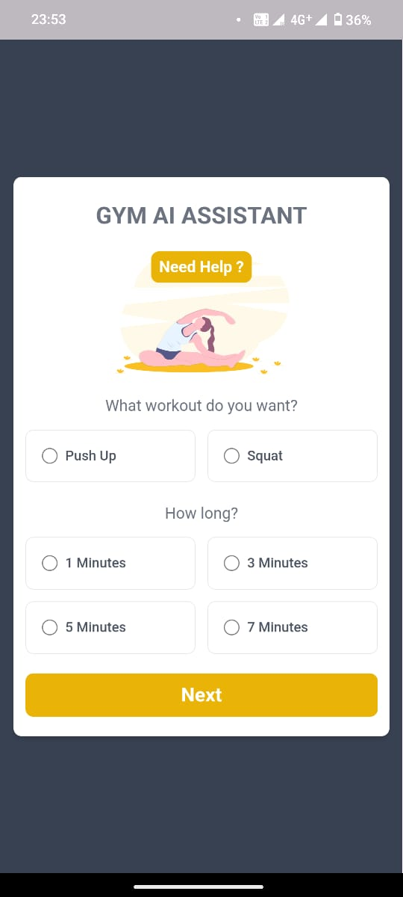
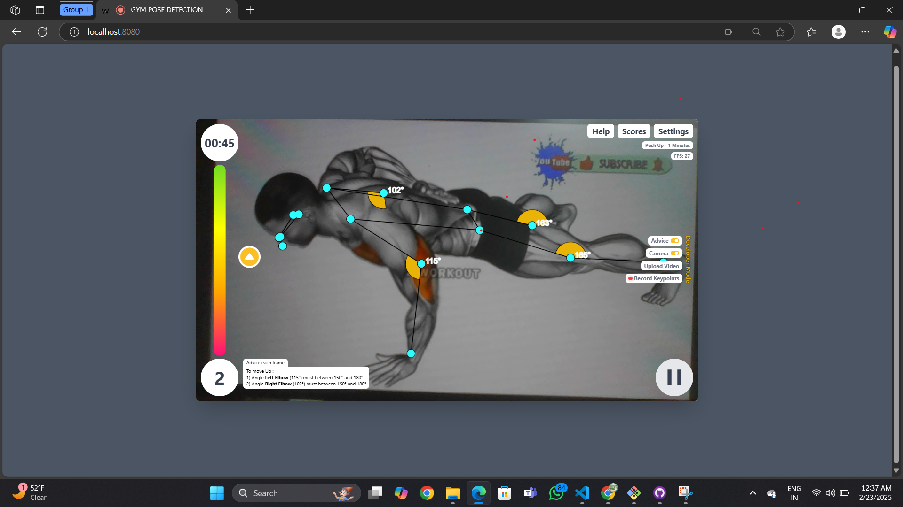

# GYM AI ASSISTANT
 The Gym Pose Detection Using AI project is designed to revolutionize fitness training by leveraging artificial intelligence (AI) for real-time analysis and correction of exercise form. The project incorporates computer vision and deep learning techniques to detect key body points during various exercises
 #Project run commond
 npm run start-dev

